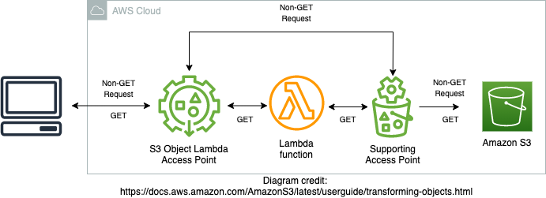

# Dynamic Content Moderation by using Amazon S3 Object Lambda and Amazon Rekognition



Amazon S3 now allows you to integrate with AWS Lambda and invoke various AWS services. In this example, you can see how image moderation is done on the fly.
You can use Amazon Rekognition to detect content that is inappropriate, unwanted, or offensive. Integrating it with AWS Lambda allows you to run it seamlessly, thus saving precious time for human moderators.

Once an image request arrives, Amazon Rekognition analyzes the image from S3 and returns a moderation response. If the image contains sensitive content, the image is blurred, Otherwise, it's returned as-is.

This is one example of various capabilities. You could also translate content to a desired language, or redact personally identifiable information (PII).

## Prerequisites
- [AWS CLI](https://aws.amazon.com/cli/)
- [AWS SAM CLI](https://docs.aws.amazon.com/serverless-application-model/latest/developerguide/serverless-sam-cli-install.html)
- pip package manager 
- Python 3.9

## Setup Instructions
- Clone the repository
- Configure AWS CLI (if needed)
- Build the deployment package:\
`sam build`
- Deploy to AWS (under the hood this will deploy an AWS CloudFormation stack):\
`sam deploy --guided` 


## Usage: Image Moderation (blurring)
To use the image moderation feature just add images to the S3 bucket which is created during the SAM deploy process. 
Then retrieve the images via the S3 object lambda access point (OLAP) by using the S3 OLAP Amazon Resource Name (ARN) as the bucket name.
You can find the S3 bucket name and the S3 OLAP ARN in the outputs of the SAM deployment process in the CLI or by checking the outputs tab of the created CloudFormation stack.

For example:
- Get a few images. We will take two images from the Amazon Rekognition public sample bucket:\
`aws s3api get-object --bucket aws-rek-immersionday-eu-west-1 --key media/object-detection/cars.png images/cars.png`\
`aws s3api get-object --bucket aws-rek-immersionday-eu-west-1 --key media/content-moderation/yoga_swimwear_resized.jpg images/yoga_swimwear.jpg`
- Upload the images to the S3 bucket created before:\
`aws s3 sync images/ s3://<S3 Bucket Name>`
- Retrieve image with moderation (blurred):\
`aws s3api get-object --bucket <S3 OLAP ARN> --key yoga_swimwear.jpg  images/olap_yoga_swimwear.jpg`
- Retrieve image with moderation (unchanged):\
`aws s3api get-object --bucket <S3 OLAP ARN> --key cars.png images/olap_cars.png`

## Clean up
- Remove the images from the bucket:\
`aws s3 rm s3://<bucket-name> --recursive`\
*Note: If you have versioning enabled for the bucket you will also need to remove the delete markers for the next step to succeed.*
- Delete the deployed stack by calling:\
`sam delete`

## Permissions
In order to retrieve objects via the S3 object lambda access point the minimal set of permissions that an IAM policy needs is:
- Right to invoke the lambda function, i.e. the S3 OLAP's lambda function
- Right to get/list objects via the S3 access point
- Right to get/list objects for the S3 object lambda
You can find more details in [AWS documentation](https://docs.aws.amazon.com/AmazonS3/latest/userguide/olap-policies.html).
Below is an example policy.

```json
{
    "Version": "2012-10-17",
    "Statement": [
        {
            "Sid": "AllowLambdaInvocation",
            "Effect": "Allow",
            "Action": "lambda:InvokeFunction",
            "Resource": "arn:aws:lambda:<REGION>:<ACCOUNT_ID>:function:<LAMBDA_FUNCTION_NAME>",
            "Condition": {
                "ForAnyValue:StringEquals": {
                    "aws:CalledVia": "s3-object-lambda.amazonaws.com"
                }
            }
        },
        {
            "Sid": "AllowObjectLambdaAccess",
            "Effect": "Allow",
            "Action": "s3-object-lambda:GetObject",
            "Resource": "arn:aws:s3-object-lambda:<REGION>:<ACCOUNT_ID>:accesspoint/image-blur-olap"
        },
        {
            "Sid": "AllowStandardAccessPointAccess",
            "Effect": "Allow",
            "Action": [
                "s3:Get*",
                "s3:List*"
            ],
            "Resource": "arn:aws:s3:<REGION>:<ACCOUNT_ID>:accesspoint/image-blur-ap/*",
            "Condition": {
                "ForAnyValue:StringEquals": {
                    "aws:CalledVia": "s3-object-lambda.amazonaws.com"
                }
            }
        }
    ]
}
```

## Security

See [CONTRIBUTING](CONTRIBUTING.md#security-issue-notifications) for more information.

## License

This library is licensed under the MIT-0 License. See the LICENSE file.

